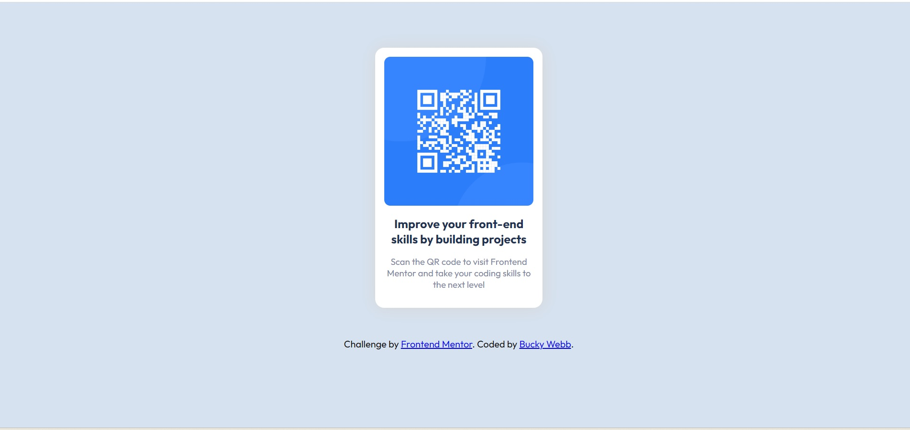

# Frontend Mentor - QR code component solution

This is a solution to the [QR code component challenge on Frontend Mentor](https://www.frontendmentor.io/challenges/qr-code-component-iux_sIO_H). Frontend Mentor challenges help you improve your coding skills by building realistic projects. 

## Table of contents

- [Overview](#overview)
  - [Screenshot](#screenshot)
  - [Links](#links)
- [My process](#my-process)
  - [Built with](#built-with)
  - [What I learned](#what-i-learned)
- [Author](#author)

## Overview

A perfect first challenge if you're new to HTML and CSS. The card layout doesn't shift, so it's ideal if you haven't learned about building responsive layouts yet.

### Screenshot

### Links

- Solution URL: (https://github.com/buckywebb/qr-code-component-main)
- Live Site URL: (https://buckywebb.github.io/qr-code-component-main/)

## My process

### Built with

- Semantic HTML5 markup
- CSS custom properties

### What I learned

I learned how rusty I am with my HTML and CSS basics. It took some playing around with paddings and margins but finally got it to a point that I am happy with it.

## Author

- Github - [buckywebb](https://github.com/buckywebb)
- Frontend Mentor - [@buckywebb](https://www.frontendmentor.io/profile/buckywebb)
- Twitter - [@bucky_webb](https://twitter.com/bucky_webb)